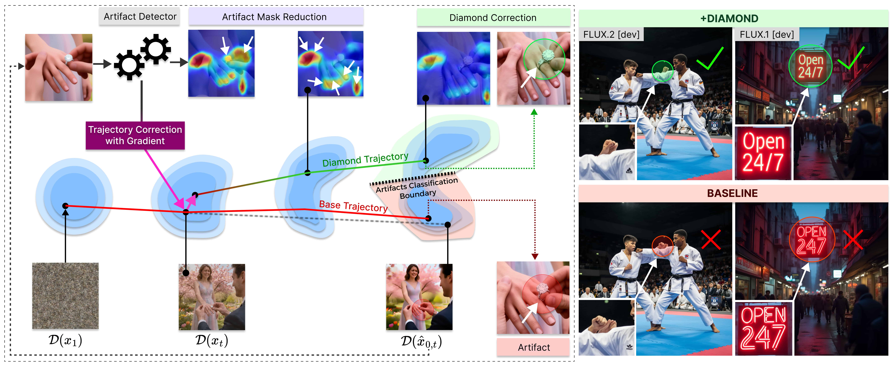

# DIAMOND: Directed Inference for Artifact Mitigation in Flow Matching Models

<div align="center">

🌐 **[Project Page](https://gmum.github.io/DIAMOND/)** &nbsp;&nbsp;|&nbsp;&nbsp; 📄 **[arXiv](https://arxiv.org/abs/2602.00883)**
<br>

[Alicja Polowczyk*](https://www.linkedin.com/in/alicja-polowczyk-064739266/), [Agnieszka Polowczyk*](https://www.linkedin.com/in/agnieszka-polowczyk-91381323a/), [Piotr Borycki](https://www.linkedin.com/in/piotr-borycki-560052251), [Joanna Waczyńska](https://www.linkedin.com/in/joannawaczynska/), [Jacek Tabor](https://scholar.google.pl/citations?user=zSKYziUAAAAJ&hl=pl), [Przemysław Spurek](https://scholar.google.com/citations?hl=en&user=0kp0MbgAAAAJ)  
(*equal contribution)


</div>

---

<p align="center">

</p>

**DIAMOND** is a *training-free, inference-time guidance framework* that tackles one of the most persistent challenges in modern text-to-image generation: **visual and anatomical artifacts**.

While recent models such as FLUX achieve impressive realism, they still frequently produce distorted structures, malformed anatomy, and visual inconsistencies. Unlike existing post-hoc or weight-modifying approaches, DIAMOND intervenes **directly during the generative process** by reconstructing a clean sample estimate at each step and **steering the sampling trajectory away from artifact-prone latent states**.

The method requires **no additional training, no finetuning, and no weight modification**, and can be applied to both **flow matching models and standard diffusion models**, enabling robust, zero-shot, high-fidelity image synthesis with substantially reduced artifacts.

---

## 📰 News

- **Feb. 2026**: Initial codebase released with support for **FLUX models** (FLUX.1-dev, FLUX-schnell, FLUX-2-dev).
- **Feb. 2026**: Paper is available on arXiv.
- **Coming Soon**: **SDXL code** will be added to the repository.


## ⚙️ Environment Setup

We provide two separate environment configurations depending on the model variant.

### 🔹 Option A — FLUX.1 [dev], FLUX.1 [schnell], SDXL


```bash
conda create -n diamond python=3.11 -y
conda activate diamond

pip install torch==2.6.0 torchvision==0.21.0 \
  --index-url https://download.pytorch.org/whl/cu126

pip install -r requirements.txt
```
### 🔹 Option B — FLUX-2-dev
Requires a newer version of diffusers installed directly from GitHub.


```bash
conda create -n diamond-flux2 python=3.10 -y
conda activate diamond-flux2

pip install torch==2.5.1 torchvision==0.20.1 torchaudio==2.5.1 \
  --index-url https://download.pytorch.org/whl/cu118

pip uninstall diffusers -y
pip install git+https://github.com/huggingface/diffusers.git -U

pip install -r requirements2.txt

```
## 📦 SOTA Method Weights

We release **our trained model weights** for several state-of-the-art artifact mitigation methods.


| Base Model        | DiffDoctor | HPSv2 | HandsXL |
|-----------------|------------|-------|---------|
| FLUX.1 [dev]    | Coming Soon | Coming Soon | Coming Soon |
| FLUX.1 [schnell]| Coming Soon | Coming Soon | — |
| SDXL            | — | — | Coming Soon |
| FLUX.2 [dev]   | — | — | — |

Full evaluation datasets (CSV files with prompts and corresponding random seeds) are provided in the `datasets/` directory.  
For **SDXL**, a shortened dataset variant is released, as no random seeds producing artifact-containing images could be found for some prompts.

# DIAMOND

## 🚀 Generate a Single Image

Move to the repository root:

```bash
cd DIAMOND
```
You can select the base model using `model=dev` (**FLUX.1 [dev]**) or `model=schnell` (FLUX.1 **[schnell]**).
Setting `guidance.enabled=true` enables **DIAMOND guidance** during sampling. To run **without DIAMOND (baseline)**, set `guidance.enabled=false`.
You can also modify the `loss` type and the `lambda_schedule` to explore different guidance behaviors.

### Run Generation
```bash
python src/generate_single_image.py \
  model=dev \
  'prompt="Luxury crystal blue diamond, premium brand mark, vector style, simple and iconic, 4k resolution"' \
  seed=100285 \
  guidance.enabled=false \
  loss=power \
  lambda_schedule=power \
  lambda_schedule.start=25 \
  lambda_schedule.end=1 \
  lambda_schedule.power=2 \
  output.run_name=example_run
```

For **FLUX.2 [dev]**, use the separate script:
```bash
python src/generate_single_image_flux2.py \
  model=flux2dev \
  'prompt="Luxury crystal blue diamond, premium brand mark, vector style, simple and iconic, 4k resolution"' \
  seed=100285 \
  output.run_name=example_run
```
> [!IMPORTANT]
> Activate the correct Conda environment before running (see Environment Setup).
> Outputs are saved to the `outputs/ directory`.
